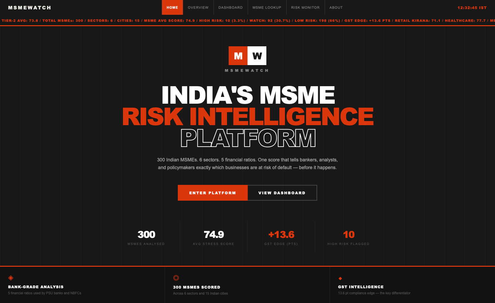
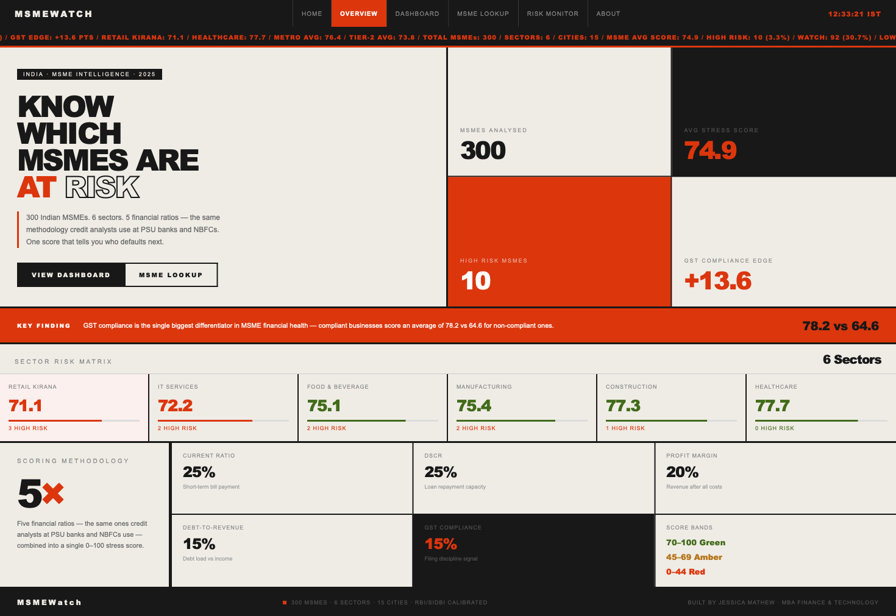
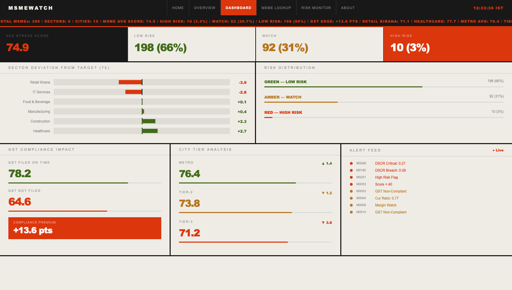
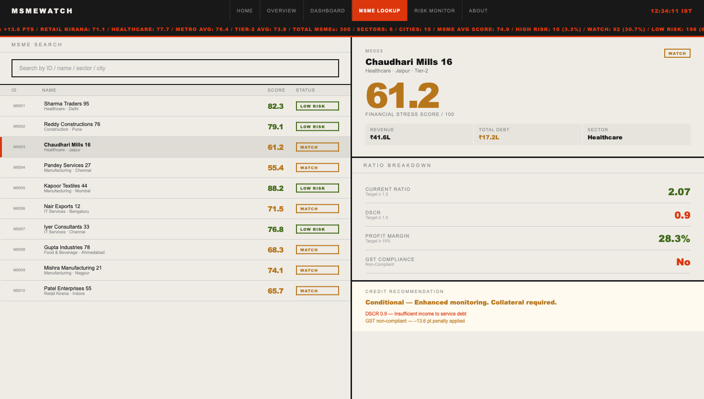
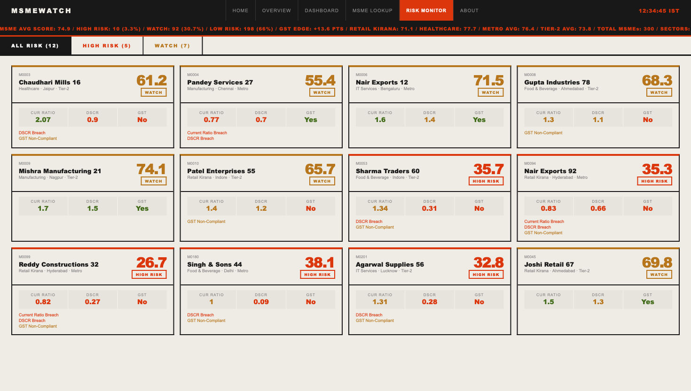
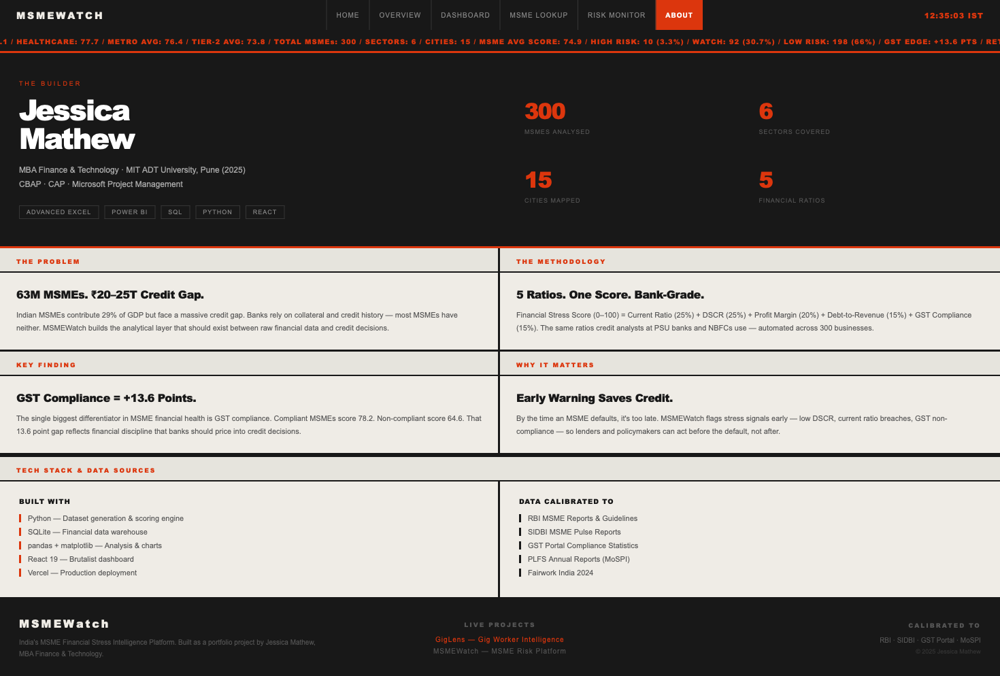

<div align="center">

# ◈ MSMEWatch

### India's MSME Financial Stress Intelligence Platform

[](https://msmewatch.vercel.app)
[](https://react.dev)
[](https://python.org)
[](https://sqlite.org)
[](https://vercel.com)

<br/>

> **63 million MSMEs. ₹20–25 trillion credit gap. Zero early warning system.**
> MSMEWatch is the analytical layer that should exist between raw financial data and credit decisions.

<br/>



</div>

---

## 🔴 The Problem

India's MSMEs contribute **29% of GDP** and employ over **110 million people** — yet face a ₹20–25 trillion credit gap. Banks rely on collateral and credit history. Most MSMEs have neither.

By the time an MSME defaults, it's too late. MSMEWatch flags stress signals **before** the default — using the same 5 financial ratios credit analysts at PSU banks and NBFCs already use.

---

## ⚡ Key Finding

> **GST compliance is the single biggest differentiator in MSME financial health.**

| GST Status | Avg Financial Stress Score |
|---|---|
| ✅ GST Compliant | **78.2 / 100** |
| ❌ GST Non-Compliant | **64.6 / 100** |
| **Compliance Premium** | **+13.6 points** |

A 13.6 point gap — from a dataset of 300 businesses across 6 sectors — that banks should be pricing into every credit decision.

---

## 🖥️ Platform Screenshots

### Overview


### Dashboard


### MSME Lookup


### Risk Monitor


### About


---

## 📊 Scoring Methodology

MSMEWatch calculates a **Financial Stress Score (0–100)** using 5 ratios — the same methodology credit analysts at PSU banks and NBFCs use.

| Ratio | Weight | What It Measures | Green Threshold |
|---|---|---|---|
| 📈 Current Ratio | **25%** | Ability to pay short-term obligations | ≥ 1.5 |
| 💳 DSCR | **25%** | Debt service coverage — can they repay loans? | ≥ 1.5 |
| 💰 Profit Margin | **20%** | Revenue remaining after all costs | ≥ 15% |
| 🏦 Debt-to-Revenue | **15%** | Debt load relative to income | Lower is better |
| 🧾 GST Compliance | **15%** | Filing on time = financial discipline signal | Compliant |

### Score Bands

```
70 – 100  ██████████████████  🟢 GREEN  —  Low Risk
45 – 69   ████████████        🟡 AMBER  —  Watch
 0 – 44   ██████              🔴 RED    —  High Risk / Immediate Action
```

---

## 📈 Results — 300 MSMEs Analysed

```
Total MSMEs Analysed  →  300
Average Stress Score  →  74.9 / 100
Sectors Covered       →  6
Cities Mapped         →  15
```

### Risk Distribution

| Status | Count | Portfolio % |
|---|---|---|
| 🟢 Low Risk | 198 | 66% |
| 🟡 Watch | 92 | 31% |
| 🔴 High Risk | 10 | 3% |

### Sector Risk Matrix

| Sector | Avg Score | High Risk | Status |
|---|---|---|---|
| 🏥 Healthcare | **77.7** | 0 | 🟢 Safest |
| 🏗️ Construction | 77.3 | 1 | 🟢 Low Risk |
| 🏭 Manufacturing | 75.4 | 2 | 🟢 Low Risk |
| 🍱 Food & Beverage | 75.1 | 2 | 🟡 Watch |
| 💻 IT Services | 72.2 | 2 | 🟡 Watch |
| 🛒 Retail Kirana | **71.1** | 3 | 🔴 Most Stressed |

---

## 🏗️ Architecture

```
msmewatch/
├── data/
│   ├── msme_data.csv           # 300 MSME synthetic dataset
│   ├── scored_msmes.json       # Scored output with all ratios
│   └── msmewatch.db            # SQLite financial database
│
├── scripts/
│   ├── generate_msme_data.py   # Dataset generator — RBI/SIDBI calibrated
│   ├── scoring_engine.py       # 5-ratio Financial Stress Score calculator
│   ├── load_to_sqlite.py       # Loads CSV → SQLite (2 tables)
│   └── analysis.py             # Sector analysis, charts, key insights
│
├── screenshots/                # Platform screenshots
│   ├── 1.homepage.png
│   ├── 2.overview.png
│   ├── 3.dashboard.png
│   ├── 4.MSME_lookup.png
│   ├── 5.Risl_monitor.png
│   └── 6.About.png
│
└── msmewatch-app/              # React 19 frontend
    └── src/
        └── App.js              # Full platform — 6 pages, bold brutalist UI
```

---

## 🛠️ Tech Stack

| Layer | Tool | Purpose |
|---|---|---|
| 🐍 Dataset | Python (`random`, `csv`) | 300 synthetic MSMEs, RBI/SIDBI calibrated |
| 🗄️ Database | SQLite | `msme_master` + `msme_scores` tables |
| 📊 Analysis | pandas + matplotlib | Sector analysis, deviation charts |
| ⚛️ Frontend | React 19 | Bold Brutalist dashboard — 6 pages |
| 🚀 Deployment | Vercel | Production deployment |
| 🔧 Version Control | GitHub | Full project history |

---

## 📦 Data Sources

All synthetic data is calibrated against real Indian regulatory and research benchmarks:

- 🏦 **RBI** — MSME credit and financial ratio guidelines
- 📑 **SIDBI MSME Pulse Reports** — Sectoral benchmarks
- 🧾 **GST Portal** — Compliance rate statistics
- 📋 **PLFS Annual Reports (MoSPI)** — Labour and business data
- ⚖️ **Fairwork India 2024** — Platform and gig economy data

---

## 🚀 Run Locally

```bash
# Clone the repo
git clone https://github.com/jessicamathew31-coder/-msmewatch.git
cd -msmewatch

# Generate dataset
python3 scripts/generate_msme_data.py

# Run scoring engine
python3 scripts/scoring_engine.py

# Load to SQLite
python3 scripts/load_to_sqlite.py

# Run analysis
python3 scripts/analysis.py

# Start React dashboard
cd msmewatch-app
npm install
PORT=3001 npm start
```

---

## 💡 Interview Talking Points

- *"I built a financial stress early warning system for MSMEs using the same 5 ratios credit analysts at PSU banks and NBFCs use"*
- *"My analysis found that GST compliance alone accounts for a 13.6 point score advantage — a data-backed finding from a dataset of 300 businesses"*
- *"The Bold Brutalist UI was a deliberate design choice — MSMEWatch is meant to feel like a tool a banker would actually use, not a student project"*
- *"The project covers the full BA stack — data generation, SQL analysis, Python scoring, financial ratio methodology, and a deployed interactive dashboard"*

---

## 🔗 Related Projects

| Project | Description | Live |
|---|---|---|
| [GigLens](https://github.com/jessicamathew31-coder/giglens) | India's Gig Worker Financial Health Audit Engine | [giglens-74r9.vercel.app](https://giglens-74r9.vercel.app) |
| MSMEWatch | India's MSME Financial Stress Intelligence Platform | [msmewatch.vercel.app](https://msmewatch.vercel.app) |

---

## 👩‍💼 About the Builder

**Jessica Mathew** — MBA Finance & Technology, MIT ADT University, Pune (2025)

`CBAP` `CAP` `Microsoft Project Management` `Advanced Excel` `Power BI` `SQL` `Python` `React`

MSMEWatch is a production-grade portfolio project that demonstrates end-to-end Business Analyst capability — from data generation and financial modelling to SQL analysis, Python scoring engines, and a deployed interactive dashboard.

---

<div align="center">

**Built with ◈ by Jessica Mathew**

[](https://linkedin.com/in/jessicamathew)
[](https://github.com/jessicamathew31-coder)
[](https://msmewatch.vercel.app)

*300 MSMEs · 6 Sectors · 15 Cities · RBI/SIDBI Calibrated*

</div>
